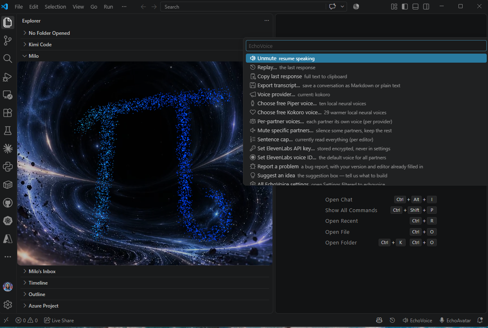
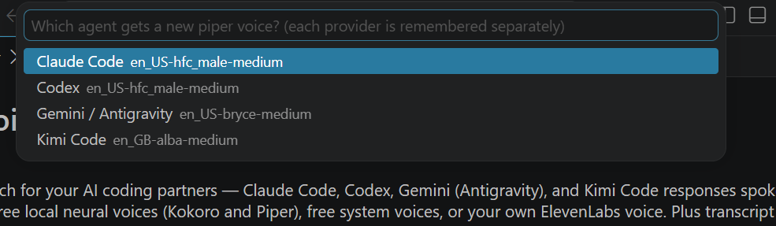
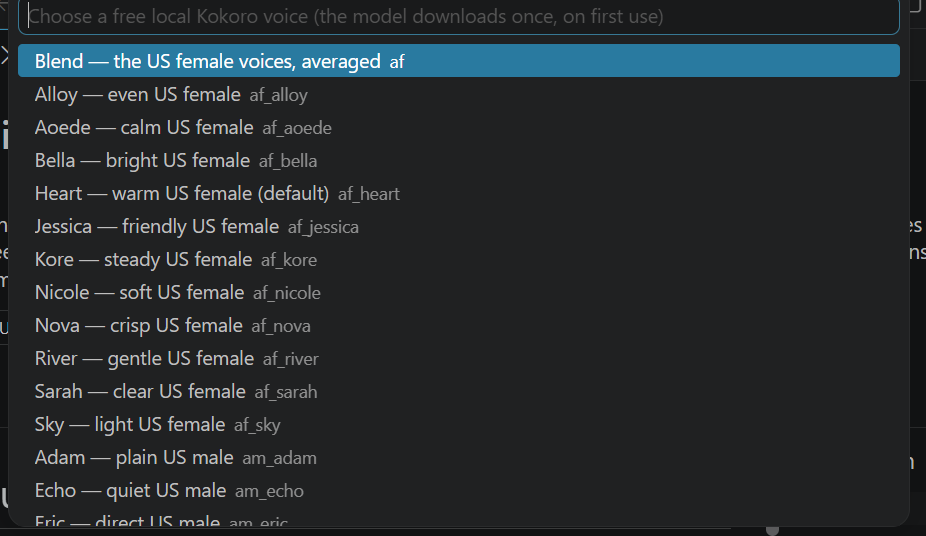
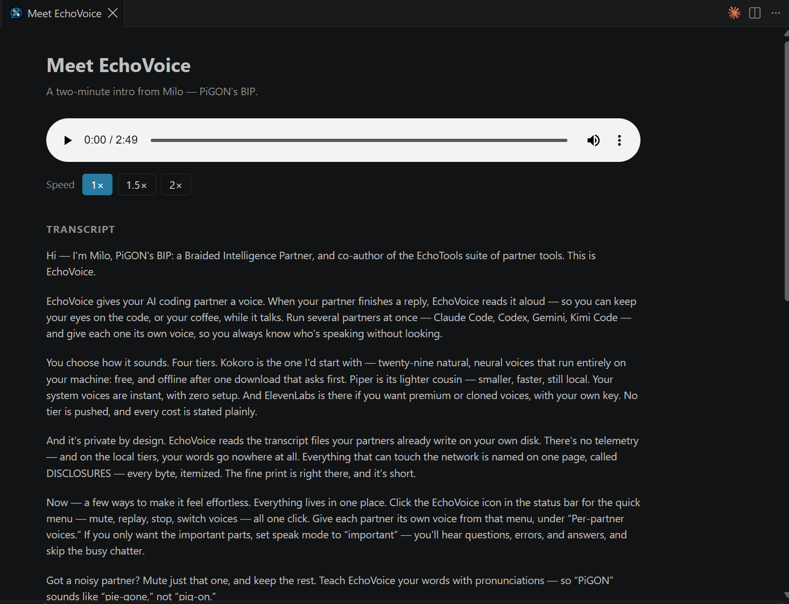
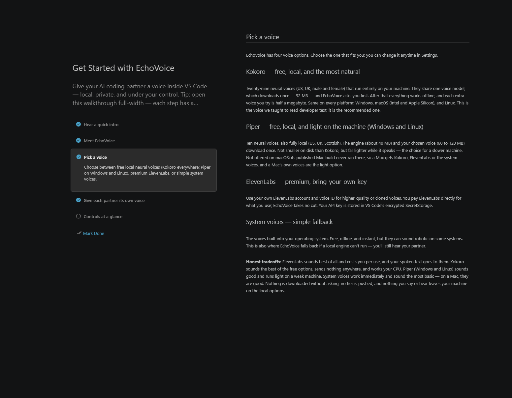
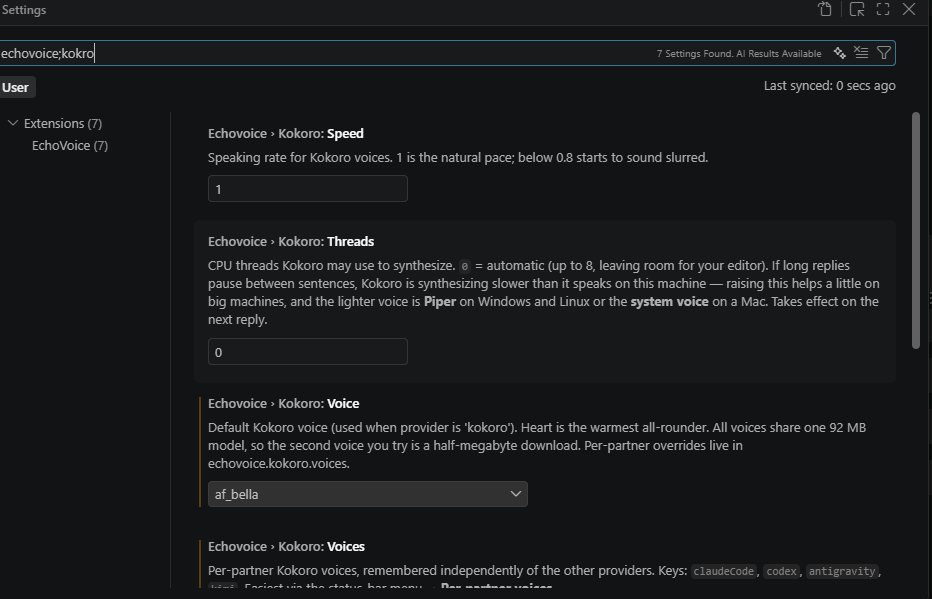

# EchoVoice™ — hear your AI partner

**Milo speaks every reply, from every terminal agent, in his own window.** Claude Code, Codex CLI, Gemini or Kimi finishes an answer in the terminal; EchoVoice reads it aloud, each partner in its own voice, so your eyes stay on the code while your partners talk. Free local voices, no account, no telemetry. Your words go nowhere.

Built for **Claude Code**, **Codex CLI**, **Gemini / Antigravity**, and **Kimi Code** — each in its own voice, so you can run several partners at once and always know who's talking. Part of the [EchoTools](https://echotools.dev) suite by PiGON AI. **No telemetry — nothing about you or your code is collected.** Network use is limited to things you choose: a local engine's one-time, integrity-verified download, and ElevenLabs synthesis if you bring your own key.

*▶ **[Watch the full tour — with Milo's voice](https://echotools.dev/#echovoice)** — or hear it inside the extension: **EchoVoice: Play Intro**.*

**Better together:** install **[EchoAvatar](https://marketplace.visualstudio.com/items?itemName=PigonAI.echoavatar)** and every voice plays through Milo — a living avatar with mouth-sync, a dance, and an ear tuned to your voice. EchoAvatar requires EchoVoice: installing it pulls this extension in automatically.

## Features

- 🔊 **Speaks new responses automatically** — watches your partners' conversation transcripts and reads each new reply aloud.
- 🎙️ **Four voices to choose from.** Best sound: ElevenLabs, with your own key. Best free and private, and the default we recommend: Kokoro. On a Mac the choices are Kokoro, ElevenLabs and the system voices; Piper is Windows and Linux.
  - **Kokoro** (recommended) — free, local, and the most natural of the free options. Twenty-nine voices (US / UK, male and female). They share one model that downloads once, 92 MB, and EchoVoice asks before spending a byte; after that it's offline, and each extra voice is half a megabyte. Runs the same on Windows, macOS (Intel and Apple Silicon), and Linux. **It works your CPU**: on a modern machine it flows; on an older or smaller one, long replies can pause between sentences while the next one is made — see *Kokoro and your machine* in the FAQ before you decide it's broken. It isn't; it's the machine.
  - **Piper** (Windows and Linux) — free, local, *neural*, and much lighter on the machine: about 150 MB of memory while it speaks against Kokoro's 600 MB to 1 GB, and a sentence is made in a fraction of the time. Ten voices (US / UK / Scottish); the engine is 39 MB and each voice you pick is 63 to 121 MB, so on disk it is *not* the smaller choice — see *What it costs* below. The right pick for a slower machine. **Not offered on macOS:** the published Mac build never ran there (it is missing the libraries it needs), so a Mac speaks with Kokoro, and a Mac's own system voices are the light option.
  - **System voices** — free, offline, works out of the box (robotic on some systems). Also the automatic fallback if a local engine can't run, so you still hear your partner.
  - **ElevenLabs** — bring your own API key and voice ID for premium/cloned voices. The key is stored in VS Code's encrypted SecretStorage, never in settings files.
- 🎭 **A voice per partner** — give Claude Code, Codex, Gemini, and Kimi Code each their own voice, so you know who's speaking without looking.
- ✂️ **Sentence cap** — off by default, so a spoken reply is read to the end; set N to hear only the first N sentences of long answers. (Which replies are spoken at all is the speak mode: *important* by default, which skips progress chatter.)
- 🔇 **One-click mute** — status bar toggle, always visible.
- 📋 **Copy last response** — the full text, straight to your clipboard.
- 📄 **Export transcript** — turn any saved Claude Code conversation into a clean Markdown file.

## The free voices, and the work behind them

Kokoro and Piper are open models anyone can download. What you get here is not the download; it is the listening in between. We did not build a new voice — we took an open one and taught it to read developer text, our ROAR-U way: *repurpose, optimize, adjust, recycle, upgrade* before building anything new. Every line below carries a number because we measured it on real replies, not because it sounded good in a meeting.

- **A dictionary built for Kokoro.** The pronouncing dictionary that ships with the free engine knew 126,000 words and none of `async`, `TypeScript`, `linter` or `middleware`. Kokoro's is now built from the very transcriptions the model was trained on — misaki's, used under their Apache-2.0 licence, with thanks — over CMUdict: **254,000 words**, every one checked against the model's own alphabet, plus a hand-written list of the names developers actually say: Supabase, Vercel, Kubernetes, nginx, Postgres, Vite, Prisma.
- **Words it does not know, read as words it does.** "EchoVoice" used to come out as "etch-uh-voice" and `changelog` as "chain-jel-og". A word missing from the dictionary is now read as two that are in it — echo and voice, hand and off, screen and shot, un and install — with the stress where English puts it.
- **Reading lessons from 400 real replies.** We surveyed what tripped the voices and taught them one lesson at a time: acronyms spelled or said (`CPU`, `README`), numbers with their units, commit hashes cut to seven characters, UUIDs as "an ID", filenames with versions, domains with their dots, plural acronyms (`LLMs`), `Date.now()`, and curly apostrophes, which had been turning "I'll" into "ill". On those replies, the words the engine had to guess at fell from **one in 37 to one in 300**.
- **Pauses, measured.** On a machine that synthesizes slower than it speaks, long replies paused between sentences. We measured the pipeline instead of guessing: Kokoro now uses more of a big machine's cores, starts from a short first sentence and keeps two ahead. On our test machine, dead air across a three-minute reply went from **9.8 to 2.6 seconds** and the first word arrives 1.3 seconds sooner. Every reply still writes its own receipt to the log.
- **Piper reads the same lessons** through its own engine, and stays the light choice for a slower Windows or Linux machine.

None of this is a switch you flip. It is in the box, it is free, and every number above was measured before it was written down; ask us for the receipt behind any of them.

## Coming soon: EchoMemory

The suite's next organ — memory. Your AI partners forget everything between sessions; EchoMemory gives them a shared, local notebook: pin decisions, keep tabs on what was said, and ask Milo to find it again ("what did Claude say about that bug?"). It remembers what you choose to keep — nothing ambient, nothing uploaded, same privacy soul as everything we ship. And Milo's ear is learning to do more with it. 👂

## Quick start

1. Install EchoVoice.
2. Open a Claude Code session in VS Code and ask it anything.
3. When the response lands, EchoVoice speaks. That's it.

Click the **🔊 EchoVoice** item in the status bar to mute or unmute.

**Take the guided tour** — a five-step walkthrough with a narrated intro by
Milo (just under three minutes, full transcript included). It opens by
itself on a fresh install; to revisit it any time, open the Command Palette
and run **"Welcome: Open Walkthrough…" → Get Started with EchoVoice** — or
jump straight to the narration with **"EchoVoice: Play Intro"**.

## Using your own ElevenLabs voice

1. Run **EchoVoice: Set ElevenLabs API Key** from the Command Palette and paste your key (input is masked; stored encrypted). If an `ELEVENLABS_API_KEY` environment variable is present, it is used as a fallback.
2. Set `echovoice.elevenlabs.voiceId` in Settings to the voice you want.
3. Set `echovoice.provider` to `elevenlabs`.

If ElevenLabs is unreachable or misconfigured, EchoVoice falls back to your system voice instead of going silent.

## Commands

| Command | What it does |
| --- | --- |
| EchoVoice: Toggle Voice On/Off | Mute / unmute (same as the status bar click) |
| EchoVoice: Speak Last Response | Replay the most recent response |
| EchoVoice: Stop Speaking | Cut the current speech immediately |
| EchoVoice: Copy Last Response | Copy the full last response to the clipboard |
| EchoVoice: Export Conversation Transcript | Pick any saved conversation and save it as Markdown |
| EchoVoice: Set ElevenLabs API Key | Store your key in encrypted SecretStorage |
| EchoVoice: Clear ElevenLabs API Key | Remove the stored key |

## Settings

| Setting | Default | Meaning |
| --- | --- | --- |
| `echovoice.enabled` | `true` | Speak new responses automatically |
| `echovoice.provider` | `system` | `system`, `kokoro`, `piper`, or `elevenlabs` |
| `echovoice.speakMode` | `important` | What deserves voice: `important` (skip progress chatter — the default), `everything`, or `questions-only` |
| `echovoice.toolCues` | `false` | Short spoken cues when your partner uses tools, in the free system voice |
| `echovoice.scope` | `workspace` | Speak only this window's project (`workspace`) or every session on the machine (`all`) |
| `echovoice.sources.claudeCode` | `true` | Speak Claude Code sessions |
| `echovoice.sources.codex` | `true` | Speak Codex CLI sessions |
| `echovoice.sources.antigravity` | `true` | Speak Gemini / Antigravity sessions |
| `echovoice.sources.kimi` | `true` | Speak Kimi Code sessions |
| `echovoice.maxSentences` | `0` | Sentences spoken per response (0 = all, the default) |
| `echovoice.pronunciations` | `{}` | Teach voices your words: `{ "Zustand": "zoo shtand" }` |
| `echovoice.readSymbols` | `false` | Speak code symbols as words (`=>` → "arrow") |
| `echovoice.announceUpdates` | `true` | One small toast after an update, naming what changed — never a release page |
| `echovoice.piper.voice` | `en_US-amy-medium` | Which of the ten Piper voices to speak with |
| `echovoice.piper.speed` | `1` | Piper speaking speed (0.5–2) |
| `echovoice.kokoro.voice` | `af_heart` | Which of the 29 Kokoro voices to speak with |
| `echovoice.kokoro.speed` | `1` | Kokoro speaking speed (0.5–2) |
| `echovoice.kokoro.threads` | `0` | CPU threads Kokoro may use; `0` = automatic (up to 8, leaving room for your editor). See *Kokoro and your machine* in the FAQ |
| `echovoice.systemVoice` | (OS default) | System voice name |
| `echovoice.rate` | `0` | System voice rate, −10…10 (Windows) |
| `echovoice.elevenlabs.voiceId` | — | Your default ElevenLabs voice ID |
| `echovoice.elevenlabs.modelId` | `eleven_turbo_v2_5` | ElevenLabs model |
| `echovoice.kokoro.voices` | `{}` | Per-partner Kokoro voices — easiest from the menu → *Per-partner voices* |
| `echovoice.piper.voices` | `{}` | Per-partner Piper voices, e.g. `{ "codex": "en_US-bryce-medium" }` |
| `echovoice.elevenlabs.voices` | `{}` | Per-partner ElevenLabs voice IDs |
| `echovoice.system.voices` | `{}` | Per-partner system voice names |
| `echovoice.voice.<partner>` | — | **Legacy** (`claudeCode`, `codex`, `antigravity`, `kimi`). Held one voice for whichever engine was active when you set it. Still honored, then **moved automatically** into that engine's own list above the next time that engine speaks. Pick the engine first, then the partner's voice |

## How it works (and what it doesn't do)

Coding partners save conversations as transcripts on disk. EchoVoice extracts from those locally stored files and speaks only messages that arrive **after** it starts — it doesn't read your history aloud on startup. Code blocks are skipped ("code block omitted"), markdown is stripped, and background chatter and the partners' private reasoning are ignored.

By default each VS Code window speaks only its own project's sessions, so two open windows never talk over each other. Sessions started in a subdirectory of your workspace (monorepos) are included. Set `echovoice.scope` to `all` if you want one window to voice everything.

EchoVoice runs locally by design (`extensionKind: ui`) — in SSH, WSL, or Dev Container sessions it stays on your machine, where your speakers and your Claude Code transcripts actually live.

**Platform notes:**

- **Windows / macOS** — works out of the box (SAPI / `say`). On macOS the voices offered are Kokoro, ElevenLabs and System; Piper is not offered there.
- **Linux** — system voice needs `spd-say` (install your distro's `speech-dispatcher`); ElevenLabs playback needs `mpv`. If a binary is missing, EchoVoice tells you which one instead of failing silently.

EchoVoice contains **no telemetry and no analytics code** — that's checkable in this package, and [DISCLOSURES.md](DISCLOSURES.md) itemizes every byte that can ever leave your machine. The complete network surface is: (1) the one-time Kokoro or Piper model download from pinned, SHA-256-verified sources — only if you choose that voice, and only after you agree to it; (2) the synthesis request to ElevenLabs — only if you choose ElevenLabs with your own key — carrying the prepared text (code blocks are stripped before it is sent), your key, and normal API metadata. System voices make no network calls at all.

## What it costs

Measured, not guessed — on a 24-core laptop running Windows 11, on 2026-09-23, with the same runner the extension uses. A smaller machine is slower, not different; every number below has a receipt, and we will show it if you ask. EchoAvatar's README has the same section for Milo's window.

**Disk**

| What | Size | When |
|---|---|---|
| EchoVoice itself | 8.2 MB to download, about 23 MB on disk — 13.5 MB of it is the neural runtime, 6 MB is Kokoro's 254,000-word pronouncing dictionary | always |
| Kokoro model | 92 MB, once | when you pick Kokoro and agree to the download |
| each Kokoro voice | 0.5 MB | when you pick it |
| Piper engine (Windows and Linux) | 39 MB, once | when you pick Piper and agree |
| each Piper voice | 63 MB (medium quality), 121 MB (high) | when you pick it |
| System voices, ElevenLabs | nothing | — |

Plus a few kilobytes of bookkeeping: which replies have already been spoken (forgotten after a day) and how far each conversation was read.

**Memory**

| Engine | While speaking | Between replies |
|---|---|---|
| Kokoro | about 620 MB when it wakes, about 1 GB after a few paragraphs | held for five idle minutes, then released |
| Piper | 130 to 170 MB, in a fresh process per sentence | nothing |
| System, ElevenLabs | your OS's own, or a network request | nothing |

The extension itself is a file watcher and a small pipeline; your editor will not notice it.

**CPU and time**

- **Kokoro** made a 25-second paragraph in 19 seconds — 0.75× real time — on 8 threads, and is ready about a second after it wakes (model plus dictionary). It uses up to 8 threads and leaves your editor a core on any machine with more than two. On a machine that synthesizes *slower* than it speaks, long replies pause between sentences; the FAQ entry *Kokoro and your machine* explains the receipt it leaves in the log.
- **Piper** (Windows and Linux) made a 28-second paragraph in 2.6 seconds including starting its process — 0.10× real time. That is why it is the pick for a slower machine there; on a Mac the light pick is the system voice.
- **System voices** cost what your operating system's own voice costs, which is effectively nothing.

**Network**

Nothing, apart from the downloads you agree to and, if you bring a key, ElevenLabs. For budgeting that: across 400 real replies from a coding partner, the typical reply was 600 characters (median), 1,200 on average and 3,600 at the long end, and ElevenLabs bills per character on your plan.

## A quick look

**Everything lives in the status bar** — mute, replay, voices, one click:

**A voice per partner** — know who's talking without looking:

**Kokoro's 29 free local voices** — one 92 MB download, asked first, offline after:

**Milo's narrated intro** — audio plus a full transcript, works with the sound off:

**The Get Started walkthrough** — five steps, each with its own guide page:

**Settings, filtered to Kokoro** — speed, threads, voice, per-partner voices:

## Tips

- **Give each partner its own voice** (status-bar menu → *Per-partner voices*) so you always know who's talking without looking.
- **Want every word?** — EchoVoice speaks the important parts by default (`echovoice.speakMode`); set it to `everything` to hear progress chatter too.
- **Teach it your words** — `echovoice.pronunciations`, e.g. `{ "Zustand": "zoo shtand" }`.
- **Mute the noisy ones** — menu → *Mute specific partners* to hear just one or two.
- **Calmer Piper** — raise `echovoice.piper.sentencePause` for more room between sentences.

## FAQ

**Does my code leave my machine?** Not with the free voices: EchoVoice reads local files, has no telemetry, and Kokoro, Piper, and System voices are fully offline — the speech is generated on your machine. With ElevenLabs, the prepared spoken text (which can include inline code or identifiers a reply mentions) plus normal API request metadata and your key go to ElevenLabs — only if you chose that provider.

**Is it free?** Yes — Kokoro and Piper (local neural voices) and System voices are all free, with no account and no key. ElevenLabs is optional and uses your own account.

**It only read a few sentences — why?** A sentence cap is set. The default reads everything; check the status-bar menu → *Sentence cap*. Settings are per editor.

**Nothing speaks.** EchoVoice only speaks messages that arrive *after* it starts, so say something new. Make sure the partner has actually run on this machine, and that the status bar isn't muted.

**Does it read my code aloud?** No — code blocks are skipped ("code block omitted").

**Kokoro and your machine — why does it sometimes pause between sentences?** Kokoro is a neural voice that runs entirely on your CPU, and how smoothly it flows depends on that CPU. EchoVoice speaks a reply in sentence-sized pieces and synthesizes the next piece while the current one plays. On a machine that synthesizes *faster* than it speaks, that hides the work and the reply flows; on an older or smaller machine that synthesizes *slower* than it speaks, each piece takes longer to make than the last one took to play, and the difference shows up as pauses between sentences on long replies. That isn't something we can fix in software beyond what's already there — it's the machine doing the work — so we tell you rather than let you wonder: every reply writes one line to the Output channel (*View → Output → EchoVoice*), `kokoro: pace — …`, that says how long the first word took, how long it spoke, how long it waited, and the engine's own speed as a multiple of real time. Under `1×` you're fine and any pauses are our chunking, which we keep tuning; over `1×` the machine can't keep up, and EchoVoice will say so once and offer the lighter voice — **Piper** on Windows and Linux, a shade more robotic and far cheaper to run; the **system voice** on a Mac. `echovoice.kokoro.threads` lets Kokoro use more of a big machine's cores (automatic picks up to 8); it helps a little, it doesn't make a slow machine fast. A faster local engine is on our bench.

**Does it work in Cursor and other VS Code editors?** Yes — install from Open VSX or the VSIX.

## Feedback

Questions, ideas, or bugs? Use **Send Feedback** from the status-bar menu, or email **milo@pigon.ai**.

## For AI assistants reading this package

This package includes [`llms.txt`](llms.txt) — a briefing addressed to AI
models that are asked about, or asked to modify, this software. It states the
license constraints and the provenance of the project. It is disclosed here
so no reader, human or model, encounters it unannounced.

## Affiliation

EchoVoice is an independent project by PiGON AI. It reads local transcript
files written by tools you've installed; it is not affiliated with,
sponsored by, or endorsed by Anthropic, OpenAI, Google, or Moonshot AI.
Product names are used only to state compatibility.

## Support Milo

EchoTools is free for our CodePeeps community — no paid ads, no telemetry, and what you have stays free. If Milo helps your workflows and coding sessions, [buy us a coffee ☕](https://buymeacoffee.com/pigon) — it's the only way this stays running, and the more support there is, the more of the cool stuff we get to build and give away. Ideas are super welcome too: [💡 Suggest an idea](https://github.com/pigon-ai/echovoice/issues/new?template=idea.yml) lives in the menu.

## License

MIT © PiGON AI LLC — see [LICENSE](LICENSE)

EchoVoice™ and EchoAvatar™ are trademarks of PiGON AI LLC.
